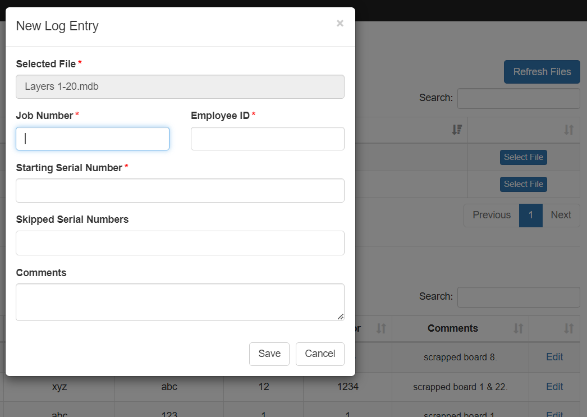
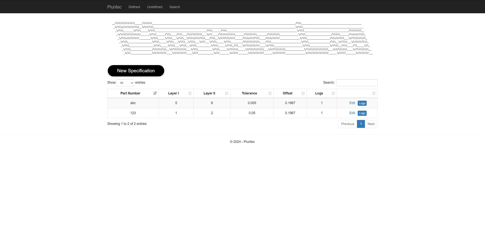

# Pluritec Layer to Layer

TLDR; This project requires Docker Desktop Linux Containers to run locally as its original program relied on production databases. 

  - As this is a web project, set P.Web as the single startup project via the properties page of the solution.
  - Run 'docker-compose up -d' in the powershell console to start this container prior to running the project, and then run 'docker-compose down' once you are finished to terminate the container.
  - (roslyn compiler folder for C# has been found to shift depending on version type, if this error occurs, simply move the folder out of P.Web/bin)
  - If desired, users can connect to the docker sql service to view the tables and data storage with the credentials outlined below;
    
>Server Name: localhost,1433

>Login Username: sa

>Password: SQLPassword123

## Overview

This project's goal was to act as a single website for engineers and operators alike working with a Pluritec X-Ray machine measuring alignment data for printed circuit boards.

As such it has two sections, one for operators, and one for engineers. The default view shows files output by the machine and allows for log entries to be made by operators with these files, or if the file cannot be found automatically, allows for manual selection.\

Upon submission of these files, the website utilizes the job number scanned by operators to query the production database and finds the associated part number. Once found it searches for a specification by which we should use to analyze the alignment data.

The second section of this project are the several specification views for engineers, those being for defined entries and undefined entries. Once a log entry is made by operators, if a specification is not found, that entry is kept on the undefined page, waiting for an engineer to create
a specification for it, otherwise if an entry was found, it is automatically analyzed by those parameters.

Below is the undefined page for entries without specifications, as well as what it would look like for an engineer to assign a specification.

Below is the defined specification page for engineers to view specifications and their respective logs.

Engineers can add new specifications on this page in ancticipation of new orders such that they never reach the undefined page at all, they can also edit existing specifications to see how the logs fare under new requirements.

For each specification there is an accompanying set of logs holding measurement data and valuable information. By clicking the log button we can see the corresponding entries for a part number for each specification.

On the above page we can see clearly and at a glance the status of any entry, any comments from operators and any serial numbers skipped due to outside interference.

Selecting the measurements button opens a pop up which displays the time of measurement, serial number of the board and corresponding measurements highlighted to show whether they fall within the stated tolerance range set when making the specification.

Going further, you can select the Layers button to view the actual measurements for each layer of the board instead of the difference between the two, as well as what layers were measured.

All of the above data analysis is done automatically and can be changed in real time by modifying the specification set by engineers, and all data is dynamically extracted from mdb files after either manual upload from operators or automatic upload through local file shares.

In order to ensure ease of access and the ability to sort through past measurement data for comparisons, a basic search page was also developed as shown below. Simply choose what search options are relevant to your query, input the search criteria, then search.

